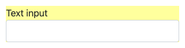
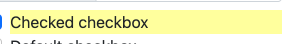
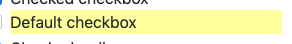
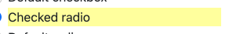
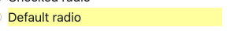
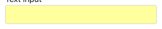
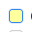
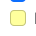
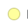

# Form Analysis Report
**URL:** https://www.selenium.dev/selenium/web/web-form.html
**Container:** `form`
**Total Elements:** 33
**Validation:** 33 unique selectors, 0 ambiguous

## Full Page View


## Table of Contents
- [LABEL](#label)
- [INPUT-TEXT](#input-text)
- [INPUT-PASSWORD](#input-password)
- [TEXTAREA](#textarea)
- [LINK](#link)
- [SELECT](#select)
- [INPUT](#input)
- [INPUT-FILE](#input-file)
- [INPUT-CHECKBOX](#input-checkbox)
- [INPUT-RADIO](#input-radio)
- [BUTTON](#button)
- [INPUT-COLOR](#input-color)
- [INPUT-RANGE](#input-range)
- [INPUT-HIDDEN](#input-hidden)

## LABEL
Found 15 element(s)

### Text input


**Selector:**
```css
label:has(#my-text-id)
```

**Properties:**
| Property | Value |
|----------|-------|
| Tag Name | `label` |
| Text Content | Text input |
| Required | No |
| Disabled | No |
| Visible | Yes |

---

### Password
![label:has(input[name="my-password"])](screenshots/element-002.png)

**Selector:**
```css
label:has(input[name="my-password"])
```

**Properties:**
| Property | Value |
|----------|-------|
| Tag Name | `label` |
| Text Content | Password |
| Required | No |
| Disabled | No |
| Visible | Yes |

---

### Textarea
![label:has(textarea[name="my-textarea"])](screenshots/element-003.png)

**Selector:**
```css
label:has(textarea[name="my-textarea"])
```

**Properties:**
| Property | Value |
|----------|-------|
| Tag Name | `label` |
| Text Content | Textarea |
| Required | No |
| Disabled | No |
| Visible | Yes |

---

### Disabled input
![label:has(input[name="my-disabled"])](screenshots/element-004.png)

**Selector:**
```css
label:has(input[name="my-disabled"])
```

**Properties:**
| Property | Value |
|----------|-------|
| Tag Name | `label` |
| Text Content | Disabled input |
| Required | No |
| Disabled | No |
| Visible | Yes |

---

### Readonly input
![label:has(input[name="my-readonly"])](screenshots/element-005.png)

**Selector:**
```css
label:has(input[name="my-readonly"])
```

**Properties:**
| Property | Value |
|----------|-------|
| Tag Name | `label` |
| Text Content | Readonly input |
| Required | No |
| Disabled | No |
| Visible | Yes |

---

### Dropdown (select)
              
                O
![label:has(select[name="my-select"])](screenshots/element-006.png)

**Selector:**
```css
label:has(select[name="my-select"])
```

**Properties:**
| Property | Value |
|----------|-------|
| Tag Name | `label` |
| Text Content | Dropdown (select)
              
                O... |
| Required | No |
| Disabled | No |
| Visible | Yes |

---

### Dropdown (datalist)
![label:has(input[name="my-datalist"])](screenshots/element-007.png)

**Selector:**
```css
label:has(input[name="my-datalist"])
```

**Properties:**
| Property | Value |
|----------|-------|
| Tag Name | `label` |
| Text Content | Dropdown (datalist) |
| Required | No |
| Disabled | No |
| Visible | Yes |

---

### File input
![label:has(input[name="my-file"])](screenshots/element-008.png)

**Selector:**
```css
label:has(input[name="my-file"])
```

**Properties:**
| Property | Value |
|----------|-------|
| Tag Name | `label` |
| Text Content | File input |
| Required | No |
| Disabled | No |
| Visible | Yes |

---

### Checked checkbox


**Selector:**
```css
label:has(#my-check-1)
```

**Properties:**
| Property | Value |
|----------|-------|
| Tag Name | `label` |
| Text Content | Checked checkbox |
| Required | No |
| Disabled | No |
| Visible | Yes |

---

### Default checkbox


**Selector:**
```css
label:has(#my-check-2)
```

**Properties:**
| Property | Value |
|----------|-------|
| Tag Name | `label` |
| Text Content | Default checkbox |
| Required | No |
| Disabled | No |
| Visible | Yes |

---

### Checked radio


**Selector:**
```css
label:has(#my-radio-1)
```

**Properties:**
| Property | Value |
|----------|-------|
| Tag Name | `label` |
| Text Content | Checked radio |
| Required | No |
| Disabled | No |
| Visible | Yes |

---

### Default radio


**Selector:**
```css
label:has(#my-radio-2)
```

**Properties:**
| Property | Value |
|----------|-------|
| Tag Name | `label` |
| Text Content | Default radio |
| Required | No |
| Disabled | No |
| Visible | Yes |

---

### Color picker
![label:has(input[name="my-colors"])](screenshots/element-013.png)

**Selector:**
```css
label:has(input[name="my-colors"])
```

**Properties:**
| Property | Value |
|----------|-------|
| Tag Name | `label` |
| Text Content | Color picker |
| Required | No |
| Disabled | No |
| Visible | Yes |

---

### Date picker
![label:has(input[name="my-date"])](screenshots/element-014.png)

**Selector:**
```css
label:has(input[name="my-date"])
```

**Properties:**
| Property | Value |
|----------|-------|
| Tag Name | `label` |
| Text Content | Date picker |
| Required | No |
| Disabled | No |
| Visible | Yes |

---

### Example range
![label:has(input[name="my-range"])](screenshots/element-015.png)

**Selector:**
```css
label:has(input[name="my-range"])
```

**Properties:**
| Property | Value |
|----------|-------|
| Tag Name | `label` |
| Text Content | Example range |
| Required | No |
| Disabled | No |
| Visible | Yes |

---

## INPUT-TEXT
Found 4 element(s)

### my-text


**Selector:**
```css
#my-text-id
```

**Properties:**
| Property | Value |
|----------|-------|
| Tag Name | `input` |
| Type | `text` |
| ID | `my-text-id` |
| Name | `my-text` |
| Label | `label[for="my-text-id"]` |
| Required | No |
| Disabled | No |
| Visible | Yes |

---

### my-disabled
![input[name="my-disabled"]](screenshots/element-017.png)

**Selector:**
```css
input[name="my-disabled"]
```

**Properties:**
| Property | Value |
|----------|-------|
| Tag Name | `input` |
| Type | `text` |
| Name | `my-disabled` |
| Placeholder | Disabled input |
| Label | `Disabled input` |
| Required | No |
| Disabled | Yes |
| Visible | Yes |

---

### my-readonly
![input[name="my-readonly"]](screenshots/element-018.png)

**Selector:**
```css
input[name="my-readonly"]
```

**Properties:**
| Property | Value |
|----------|-------|
| Tag Name | `input` |
| Type | `text` |
| Name | `my-readonly` |
| Value | Readonly input |
| Label | `my-readonly` |
| Required | No |
| Disabled | No |
| Visible | Yes |

---

### my-date
![input[name="my-date"]](screenshots/element-019.png)

**Selector:**
```css
input[name="my-date"]
```

**Properties:**
| Property | Value |
|----------|-------|
| Tag Name | `input` |
| Type | `text` |
| Name | `my-date` |
| Label | `my-date` |
| Required | No |
| Disabled | No |
| Visible | Yes |

---

## INPUT-PASSWORD
Found 1 element(s)

### my-password
![input[name="my-password"]](screenshots/element-020.png)

**Selector:**
```css
input[name="my-password"]
```

**Properties:**
| Property | Value |
|----------|-------|
| Tag Name | `input` |
| Type | `password` |
| Name | `my-password` |
| Label | `my-password` |
| Required | No |
| Disabled | No |
| Visible | Yes |

---

## TEXTAREA
Found 1 element(s)

### my-textarea
![textarea[name="my-textarea"]](screenshots/element-021.png)

**Selector:**
```css
textarea[name="my-textarea"]
```

**Properties:**
| Property | Value |
|----------|-------|
| Tag Name | `textarea` |
| Name | `my-textarea` |
| Label | `my-textarea` |
| Required | No |
| Disabled | No |
| Visible | Yes |

---

## LINK
Found 1 element(s)

### Return to index
![a[href="./index.html"]](screenshots/element-022.png)

**Selector:**
```css
a[href="./index.html"]
```

**Properties:**
| Property | Value |
|----------|-------|
| Tag Name | `a` |
| Text Content | Return to index |
| Required | No |
| Disabled | No |
| Visible | Yes |

---

## SELECT
Found 1 element(s)

### Open this select menu
                One
        
![select[name="my-select"]](screenshots/element-023.png)

**Selector:**
```css
select[name="my-select"]
```

**Properties:**
| Property | Value |
|----------|-------|
| Tag Name | `select` |
| Name | `my-select` |
| Label | `my-select` |
| Text Content | Open this select menu
                One
        ... |
| Required | No |
| Disabled | No |
| Visible | Yes |

---

## INPUT
Found 1 element(s)

### my-datalist
![input[name="my-datalist"]](screenshots/element-024.png)

**Selector:**
```css
input[name="my-datalist"]
```

**Properties:**
| Property | Value |
|----------|-------|
| Tag Name | `input` |
| Name | `my-datalist` |
| Placeholder | Type to search... |
| Label | `Type to search...` |
| Required | No |
| Disabled | No |
| Visible | Yes |

---

## INPUT-FILE
Found 1 element(s)

### my-file
![input[name="my-file"]](screenshots/element-025.png)

**Selector:**
```css
input[name="my-file"]
```

**Properties:**
| Property | Value |
|----------|-------|
| Tag Name | `input` |
| Type | `file` |
| Name | `my-file` |
| Label | `my-file` |
| Required | No |
| Disabled | No |
| Visible | Yes |

---

## INPUT-CHECKBOX
Found 2 element(s)

### my-check


**Selector:**
```css
#my-check-1
```

**Properties:**
| Property | Value |
|----------|-------|
| Tag Name | `input` |
| Type | `checkbox` |
| ID | `my-check-1` |
| Name | `my-check` |
| Label | `label[for="my-check-1"]` |
| Required | No |
| Disabled | No |
| Visible | Yes |

---

### my-check


**Selector:**
```css
#my-check-2
```

**Properties:**
| Property | Value |
|----------|-------|
| Tag Name | `input` |
| Type | `checkbox` |
| ID | `my-check-2` |
| Name | `my-check` |
| Label | `label[for="my-check-2"]` |
| Required | No |
| Disabled | No |
| Visible | Yes |

---

## INPUT-RADIO
Found 2 element(s)

### my-radio


**Selector:**
```css
#my-radio-1
```

**Properties:**
| Property | Value |
|----------|-------|
| Tag Name | `input` |
| Type | `radio` |
| ID | `my-radio-1` |
| Name | `my-radio` |
| Label | `label[for="my-radio-1"]` |
| Required | No |
| Disabled | No |
| Visible | Yes |

---

### my-radio


**Selector:**
```css
#my-radio-2
```

**Properties:**
| Property | Value |
|----------|-------|
| Tag Name | `input` |
| Type | `radio` |
| ID | `my-radio-2` |
| Name | `my-radio` |
| Label | `label[for="my-radio-2"]` |
| Required | No |
| Disabled | No |
| Visible | Yes |

---

## BUTTON
Found 1 element(s)

### Submit
![button[type="submit"]](screenshots/element-030.png)

**Selector:**
```css
button[type="submit"]
```

**Properties:**
| Property | Value |
|----------|-------|
| Tag Name | `button` |
| Type | `submit` |
| Text Content | Submit |
| Required | No |
| Disabled | No |
| Visible | Yes |

---

## INPUT-COLOR
Found 1 element(s)

### my-colors
![input[name="my-colors"]](screenshots/element-031.png)

**Selector:**
```css
input[name="my-colors"]
```

**Properties:**
| Property | Value |
|----------|-------|
| Tag Name | `input` |
| Type | `color` |
| Name | `my-colors` |
| Value | #563d7c |
| Label | `my-colors` |
| Required | No |
| Disabled | No |
| Visible | Yes |

---

## INPUT-RANGE
Found 1 element(s)

### my-range
![input[name="my-range"]](screenshots/element-032.png)

**Selector:**
```css
input[name="my-range"]
```

**Properties:**
| Property | Value |
|----------|-------|
| Tag Name | `input` |
| Type | `range` |
| Name | `my-range` |
| Value | 5 |
| Label | `my-range` |
| Required | No |
| Disabled | No |
| Visible | Yes |

---

## INPUT-HIDDEN
Found 1 element(s)

### my-hidden
![input[name="my-hidden"]](screenshots/element-033.png)

**Selector:**
```css
input[name="my-hidden"]
```

**Properties:**
| Property | Value |
|----------|-------|
| Tag Name | `input` |
| Type | `hidden` |
| Name | `my-hidden` |
| Label | `my-hidden` |
| Required | No |
| Disabled | No |
| Visible | Yes |

---

---

*Generated on 1/14/2026, 12:56:34 PM*
